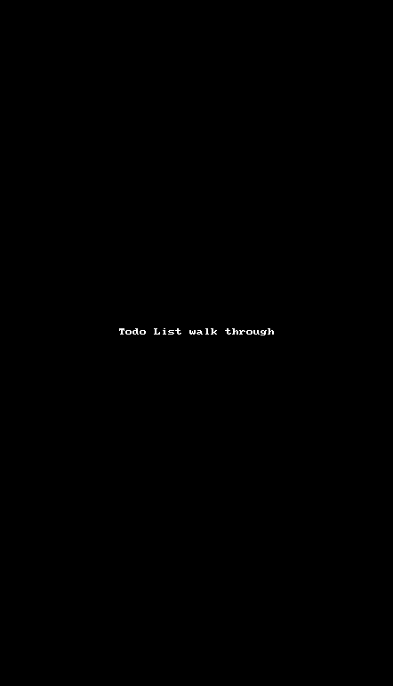

# Codepath Todo List App

This is an Android application for creating a Todo List.

Time spent: 2 hours spent in total

Completed user stories:

 * [x] User can create a todo list by clicking on add new items.
 * [x] User can delete an item by long pressing it.
 * [x] User can edit an item by clicking on it and making the nexeccary changes in the the detail page. 
Notes:

Walkthrough of all user stories:

GIF created with [LiceCap](http://www.cockos.com/licecap/).
